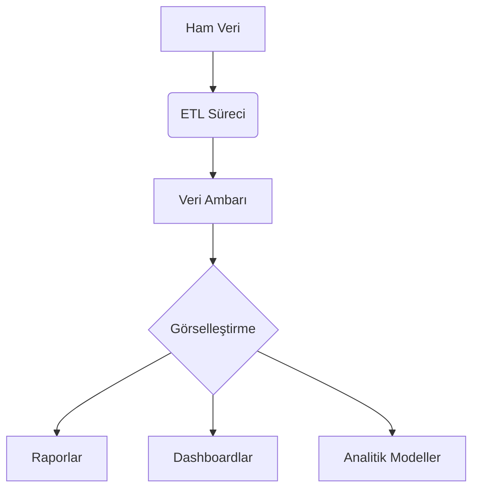

# İş Analizi ve İş Zekası  
## Sayılarla Karar Verme Sanatı

İş dünyasında her şey veriyle başlar.  
AMA veriler tek başına anlam taşımaz.  
Sayıların hikâyesini çözmek için iş analizi yapılır.  
Ve bu verilerle stratejik kararlar almak için iş zekası kullanılır.

---

## 1. İş Analizi Nedir?

İşlerin kısa sürede ve ekonomik olarak yerine getirilmesi için bilgilerin sistemli olarak toplanıp analiz edilmesidir.

Bir kurumda işleri bilimsel yöntemlerle doğru ve etkin biçimde inceleyen tekniktir.

Yapılan çalışmalar sonucu bir işin ne olduğu, niçin ve nasıl yapıldığı, iş ihtiyaçları, hedef ve amaçları ve o işin yerine getirilmesi için ne gibi bilgi yetenek ustalık ve sorumluluk gerektirdiğini saptanması işlemine denir.

Bir kurumun yapısını , temel prensipleri, durumunu anlamak , hedeflerinin gerçekleştirilmesini sağlayan çözümler sunmak için kullanılan görevler ve teknikler bütünüdür.

### Tanım ve Kapsam
İş analizi, kurumsal süreçlerin bilimsel yöntemlerle incelenerek optimize edilmesi disiplinidir. Bir işin;
- Ne olduğunu
- Neden yapıldığını
- Nasıl yapıldığını
- Hangi becerileri gerektirdiğini
sistematik olarak analiz eder.

### İş Analizinin Faydaları
- **İnsan Kaynakları Yönetimi**: Personel seçimi, eğitim ve performans değerlendirme
- **Operasyonel Verimlilik**: İş süreçlerinin optimizasyonu
- **Stratejik Planlama**: Ücret politikaları ve iş güvenliği standartlarının belirlenmesi
- **Organizasyonel Şeffaflık**: Çalışan-işveren ilişkilerinin iyileştirilmesi

İş analizi, iş süreçlerini bilimsel yöntemlerle incelemektir.  
Bir iş ne zaman yapılmalı?  
Nasıl yapılmalı?  
Kim yapmalı?  
Hangi beceriler gerekli?

### Temel Sorular (5N1K)
1. **Kim** yapıyor? (Çalışan profili)
2. **Ne** yapılıyor? (İşin tanımı)
3. **Neden** yapılıyor? (İşin gerekçesi)
4. **Nasıl** yapılıyor? (Süreç akışı)
5. **Ne zaman** yapılıyor? (Zamanlama)
6. **Nerede** yapılıyor? (Fiziksel/dijital ortam)

### Özellikleri:
- Kurumun yapısını gösterir  
- Hedeflerin nasıl ulaşılacağını açıklar  
- Gereksinimleri belirler  
- Yetenek ve sorumlulukları tanımlar  

### Faydaları:
- İnsan gücü planlaması kolaylaşır  
- Personel seçimi daha doğru yapılır  
- Eğitim programları kişiselleştirilir  
- Performans değerlendirme daha anlamlı olur  
- Ücret politikaları tutarlı olur  
- İş güvenliği sağlanır  

### İş Analizi Süreci
1. **Planlama**: Analiz kapsamının belirlenmesi
2. **Veri Toplama**:
   - Gözlem (Doğrudan süreç izleme)
   - Anket (Standartlaştırılmış sorular)
   - Görüşme (Derinlemesine bilgi edinme)
3. **Analiz**: Verilerin yapılandırılması ve yorumlanması
4. **Raporlama**: Bulguların paydaşlara sunulması

### Aşamaları:
1. **Planlama:** Ne yapılacak? Nasıl çalışacak?
2. **Hazırlık:** Hangi veriler gerekiyor?
3. **Örgütlenme:** Kim hangi rolde yer alacak?
4. **Yöntem:** İş nasıl yapılmalı?
5. **Veri Toplama:** Gerçek veriler toplanıyor.
6. **Analiz:** Sayılar inceleniyor. Çıkarımlar yapılıyor.

> 📊 Grafik Açıklaması:  
İş analizi süreci diyagramı – Planlama → Hazırlık → Örgütlenme → Yöntem → Veri Toplama → Analiz  

---

## 2. İş Analistinin Görevi

İş analisti, sayıların arkasındaki insanları görür.  
Süreçleri tanır.  
Veriyi anlamlandırır.  
Karar vericilere yol gösterir.

### Aranan Beceriler:
- **Analitik Düşünme:** Sayılar arasında bağlantı kurar.  
- **Alan Bilgisi (Domain Knowledge):** O sektörü bilir.  
- **İletişim Yeteneği:** Teknik olmayan kişilerle konuşabilir.  
- **Etkileşim Yetenekleri:** Takım içinde çalışır.  
- **Teknoloji Bilgisi:** SQL, Excel, BI araçlarını kullanır.

---

## 3. İş Zekası Nedir?

İş zekası, veriyi anlama sanatıdır.  
Ham veriyi işlemez.  
AMA işlenmiş veriyi analiz eder.  
Ve bunlardan bilgi çıkarır.

Ex:  
Satış verilerini alır.  
Zaman içinde karşılaştırır.  
Trendleri gösterir.  
Ve “bu ay kim daha çok sattı?” sorusuna yanıt verir.

### Kullanım Alanları:
- Müşteri davranış analizi  
- Satış trendleri  
- Operasyonel raporlar  
- Stratejik planlama  

---

## İş Zekası Süreci

### İş Zekası Süreci

### 1. **Veriyi Toplama**
Veri yapılandırılmış, yarı yapılandırılmış ya da yapılandırılmamış olabilir.  
CSV, Excel, API, log dosyası…  
Her yerden alınabilir.

### 2. **Veriyi Hazırlama**
Extract – Transform – Load (ETL) işlemi burada yapılır.  
Veri temizlenir.  
Dönüştürülür.  
Amaca uygun hale getirilir.

### 3. **Görselleştirme**
Sayılar sessiz kalır.  
AMA görseller konuşur.  
Dashboard’lar ile satışlar, müşteri segmentleri, gelir dağılımı gibi bilgiler tek bakışta anlaşılır.

### 4. **Raporlama**
Analiz sonuçları rapor haline getirilir.  
PDF, web arayüz, interaktif panel gibi formatlarda sunulur.

### 5. **Paylaşma**
Analiz edilen bilgi,  
yöneticilere,  
satış ekibine,  
strateji gruplarına  
paylaşılmak zorundadır.

---

## İş Zekasının Bileşenleri

| Bileşen | Açıklama |
|--------|----------|
| **Raporlar** | Satış rakamları, müşteri durumu, operasyonel veriler |
| **Özetler** | Genel performans özetleri, aylık tablolar |
| **Gösterge Tabloları** | Satış sayısı, müşteri sayısı gibi ana metrikler |
| **Grafikler** | Trendleri görmek için çizgi grafikler, pasta grafikler |
| **Çizelgeler** | Performans takibi, görev atamaları |
| **Haritalar** | Coğrafi veriler, şehir bazlı satışlar |

| Bileşen | Açıklama | Örnek Kullanım |
|---------|----------|----------------|
| **Raporlar** | Statik veri sunumları | Aylık satış raporu |
| **Dashboard** | Etkileşimli performans göstergeleri | CEO panosu |
| **OLAP** | Çok boyutlu analiz | Satışların bölge/ürün/zaman dağılımı |
| **Data Mining** | Örüntü tanıma | Müşteri churn tahmini |

---

## İş Zekasının Avantajları

| Avantaj | Açıklama |
|--------|----------|
| **Verimlilik Artışı** | Süreçler hızlanır. Kararlar hızlı alınır. |
| **Görünürlük** | Herkes aynı sayfada olur. Sayılar açıkça görülür. |
| **Sorumluluk** | Raporlar net olduğu için kim ne yaptı belli olur. |
| **Genel Bakış** | Tüm organizasyonun genel durumu tek pencerede görülür. |
| **Süreç Kolaylığı** | Analizlerle işler kolaylaşır. |
| **Basit Analiz** | Karmaşık veriler basitleştirilir. Herkes anlayabilir. |

---

## İş Zekasının Dezavantajları

| Dezavantaj | Açıklama |
|-----------|----------|
| **Maliyet** | Sistem kurulumu pahalı olabilir. |
| **Karmaşıklık** | Büyük veri ambarı, ETL işlemleri zaman alır. |
| **Sınırlı Kullanım** | Doğru eğitim almamış kullanıcılar için zor olabilir. |
| **Uzun Süreç** | Kurulum ve entegrasyon zaman alabilir. |

### Avantajlar ve Sınırlılıklar
**Avantajlar:**
✓ %30'a varan operasyonel verimlilik artışı  
✓ Karar süreçlerinde %45 hızlanma  
✓ Müşteri memnuniyetinde %25 iyileşme  

**Dezavantajlar:**
✗ Yüksek başlangıç maliyeti (lisans, altyapı)  
✗ 6-18 aylık uygulama süresi  
✗ Kullanıcı adaptasyonu gerektirmesi  

---

## İş Analizi mi? İş Zekası mı?

| Özellik | **İş Analizi** | **İş Zekası** |
|--------|----------------|----------------|
| **Amacı** | Süreçleri iyileştirmek | Karar destek sistemleri |
| **Veri Türü** | Yeni veri | Geçmiş veri |
| **Analiz Türü** | Neden-sonuç ilişkisi | Trend ve karşılaştırmalar |
| **Kullanıcı** | Yöneticiler, çalışanlar | Analistler, karar vericiler |
| **Sonuç** | Daha iyi süreçler | Daha iyi kararlar |

## Karşılaştırmalı Analiz

| Kriter | İş Analizi | İş Zekası |
|--------|------------|------------|
| **Odak** | Süreç optimizasyonu | Veri analitiği |
| **Veri Kullanımı** | Nitel/Nicel | Çoğunlukla nicel |
| **Çıktı** | İş tanımları, süreç haritaları | Raporlar, tahmin modelleri |
| **Zaman Perspektifi** | Mevcut durum | Geçmiş+Gelecek odaklı |
| **Ana Araçlar** | SWOT, BPMN | Power BI, Tableau |

## Entegrasyon Potansiyeli
İş analizi ve iş zekası birbirini tamamlayıcı disiplinlerdir:
1. **Süreç İyileştirme**: BI verileri → İş analizi önerileri
2. **KPI Tasarımı**: İş analizi ihtiyaçları → BI metriklere dönüşüm
3. **Dijital Dönüşüm**: Her iki disiplinin sinerjik kullanımı

Modern kurumsal yapılarda, bu iki disiplinin entegre kullanımı verimlilik artışı ve rekabet avantajı sağlamada kritik rol oynamaktadır.

---

## Son Söz

İş analizi, işi anlamaktır.  
Sayılarla sürecin neresinde eksik var?  
Bu soruların cevabı oradadır.

İş zekası ise sayıları anlamlandırmaktır.  
Verilerin içinde saklı olanı bulur.  
Geleceği tahmin etmeye çalışır.

İkisi de önemli.  
AMA farklı amaçlar için kullanılır.

İş analizi süreci çözer.  
İş zekası ise geleceği gösterir.

---
