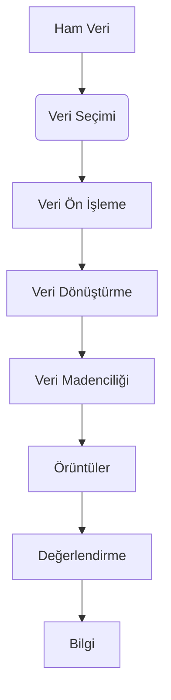

# Veri Madenciliği  
## Saklı Bilgiyi Ortaya Çıkarmak

## Tanım ve Temel Kavramlar

Veri madenciliği, büyük veri kümelerinden anlamlı örüntülerin, ilişkilerin ve eğilimlerin keşfedilmesi sürecidir. Temel özellikleri:
- **Büyük veri** kümeleriyle çalışır (milyonlarca/milyarlarca kayıt)
- **Çok değişkenli** analiz yapar
- **Gizli bilgiyi** ortaya çıkarır
- **Geleceğe yönelik** tahminler yapabilir

Veriler biriktikçe anlamlar gizlenir.  
AMA veri madenciliği sayesinde bu bilgiler çıkarılır.  

Veri madenciliği;  
milyonlarca satırın içindeki desenleri bulmak,  
ilişkileri ortaya çıkarmak,  
ve kuralları anlamak içindir.

Sayılar sessizken,  
veri madenciliği onları dinletir.  
Ve biz dinleyip karar alırız.

---

## Veri Madenciliği Nedir?

Veri madenciliği, büyük veri kümelerinden  
değerli bilgiler çıkarma sürecidir.  
AMA bu bilgiler görünmezdir.  
Algoritmalarla, istatistiksel yöntemlerle  
ve analizlerle bulunurlar.


### Kullanım Alanları:

#### 1. **Pazarlama**
Müşteri alışkanlıklarını çözmek için kullanılır.  
Satın alma davranışları incelenir.  
Kim hangi ürünü alıyor?  
Neden alıyor?

Ex:  
CRM sistemlerinde müşteri segmentasyonu yapılır.  
Satış tahmini ile kampanya planlaması yapılır.

#### 2. **Bankacılık**
Finansal işlemlerden gizli ilişkiler çıkarılır.  
Kredi kartı dolandırıcılığı tespit edilir.  
Riskli müşteriler sınıflandırılır.

Ex:  
Bir işlem “anormal” mi?  
Kredi başvurusu reddedilmeli mi?  
Veri madenciliği burada devreye girer.

#### 3. **Sağlık**
Hastalık teşhislerinde destek sağlar.  
Erken uyarı sistemi geliştirilir.  
Hasta profilleriyle hastalık riskleri tahmin edilir.

Ex:  
Belirli semptomlarla kalp hastalığı riskini tahmin etmek.

#### 4. **Sigortacılık**
Yeni poliçe talepleri tahmin edilir.  
Dolandırıcılık tespiti yapılır.  
Riskli müşteriler ayrıştırılır.

Ex:  
Hangi müşteriler daha çok tazminat alır?  
Bu bilgi gelecekteki fiyatlandırmayı değiştirir.

#### 5. **E-Ticaret**
Ziyaretçi analizi yapılır.  
Web sepetlerinin içinde saklı olanlar görülür.  
Tavsiye sistemleri kurulur.

Ex:  
“Bu ürünü alanlar aynı zamanda şunu da aldı.”  
Bu ilişki ürün önerisinde kullanılır.

## Uygulama Alanları ve Örnekler

### 1. Pazarlama ve Perakende
- **Market Sepeti Analizi**: Ürün birliktelik kuralları (X alan Y'yi de alır)
- **Müşteri Segmentasyonu**: RFM (Recency, Frequency, Monetary) analizi
- **Öneri Sistemleri**: "Bu ürünü alanlar şunları da aldı" önerileri

### 2. Finans ve Bankacılık
- **Dolandırıcılık Tespiti**: Anormal işlem desenlerinin belirlenmesi
- **Kredi Skorlama**: Müşteri risk profillerinin oluşturulması
- **Portföy Optimizasyonu**: Yatırım stratejilerinin geliştirilmesi

### 3. Sağlık
- **Hastalık Tahmini**: Risk faktörlerine göre hastalık olasılıklarının hesaplanmasi
- **Klinik Karar Destek**: Tedavi protokollerinin optimizasyonu
- **Tıbbi Görüntü Analizi**: Radyoloji görüntülerinden anomali tespiti

---

## Veri Madenciliği Süreci

```
Veri Seçimi → Ön İşleme → Dönüştürme → Modelleme → Değerlendirme
```




### 1. **Veri Seçimi**
Ham veriler arasından sadece hedefe yönelik olanlar seçilir.  
Geçmiş satış verisi mi?  
Müşteri verisi mi?

### 2. **Veri Ön İşleme**

- **Eksik Veri Çözümleri**:
  - Kayıt silme
  - Sabit değer atama
  - Ortalama/medyan değerle doldurma
  - Model tabanlı tahmin

Veri temizlenir.  
Eksik değerler tamamlanır.  
Outlier’lar düzeltilir.  
Uygun olmayan veriler çıkarılır.

Ex:  
Eksik gelir değeri varsa  
ortalama ile doldurulur.  
Ya da modelle tahmin edilir.

### 3. **Veri Bütünleştirme**

- **Veri Bütünleştirme**:
  - Çoklu kaynaklardan veri entegrasyonu
  - Entity resolution (varlık çözümleme)
   
Farklı kaynaklardan gelen veriler tek bir yapıya getirilir.  
SQL tabanlı veritabanı mı?  
CSV dosyası mı?  
JSON mu?

Tüm bu veriler birleştirilir.  
Temizlenir.  
Ve modele uygun hale getirilir.

### 4. **Veri İndirgeme**

- **Veri İndirgeme**:
  - Boyut indirgeme (PCA, LDA)
  - Veri örnekleme
  - Discretization (sürekli verinin kategorik hale dönüştürülmesi)

Çok fazla değişken varsa analiz zorlaşır.  
AMA bazı değişkenler gereksizse,  
boyut azaltılabilir.

Ex:  
PCA ile boyut indirgenir.  
Veya örneklem alınır.  
Model performansı düşmeden hız artar.

### 5. **Veri Dönüştürme**
Veriler farklı ölçeklerde olabilir.  
Ortalama ve varyans farklıysa  
model yanıltıcı olur.

Bu yüzden veriler dönüştürülür.  
Normalize edilir.  
Standardize edilir.  
Kategorik veriler sayıya çevrilir.

- Normalizasyon (Min-Max, Z-score)
- Standardizasyon
- Özellik ölçeklendirme
- Kategorik veri kodlama (One-Hot Encoding)

### 6. **Veri Madenciliği Algoritmaları**
Model kurulur.  
Veriler işlenir.  
Örüntüler çıkarılır.  
Kararlar alınır.

### 7. **Değerlendirme**
Sonuçlar test edilir.  
Doğru mu?  
Yeterince iyi mi?  
Model iyileştirilir.  
Ve yayına alınır.

> 📊 Grafik Açıklaması:  
Veri Madenciliği Süreci Diyagramı:  
Veri → Temizlik → Birleştirme → Dönüştürme → Kümeleme / Sınıflandırma → Sonuç  

---

## Veri Madenciliği Yöntemleri

### 1. **Sınıflandırma (Classification)** 

**Amaç**: Veriyi önceden tanımlı sınıflara ayırmak

**Algoritmalar**:
| Algoritma | Avantajlar | Dezavantajlar |
|-----------|------------|---------------|
| Karar Ağaçları | Yorumlanabilir, hızlı | Aşırı uydurma (overfitting) riski |
| Random Forest | Yüksek doğruluk, robust | Karmaşık yapı |
| SVM | Yüksek boyutta etkili | Parametre ayarı zor |
| Lojistik Regresyon | Basit, yorumlanabilir | Lineer sınırlar |

**Değerlendirme Metrikleri**:
- Doğruluk (Accuracy)
- Hassasiyet (Precision)
- Duyarlılık (Recall)
- F1-Score
- ROC-AUC

Verileri belirli sınıflara ayırır.  
Spam mı değil mi?  
Müşteri sipariş verecek mi?

#### Kullanılan Algoritmalar:
- Lojistik Regresyon  
- Karar Ağacı  
- Destek Vektör Makinesi (SVM)  
- Naive Bayes  
- Yapay Sinir Ağları  
- KNN  

#### Eğitim ve Test:
Veri seti ikiye ayrılır:  
- Eğitim verisi → model öğrenir  
- Test verisi → modelin başarısı ölçülür  

> 📊 Grafik Açıklaması:  
Model eğitimi diyagramı:  
Eğitim → Tahmin → Test → Doğruluk  

---

### 2. **Kümeleme (Clustering)**  

**Amaç**: Benzer veri noktalarını gruplamak

**Algoritmalar**:
- K-Means (Hızlı, ölçeklenebilir)
- Hiyerarşik Kümeleme (Dendrogram)
- DBSCAN (Gürültüye dayanıklı)
- GMM (Olasılıksal yaklaşım)

**Değerlendirme**:
- Silhouette Skoru
- Elbow Yöntemi
- Davies-Bouldin İndeksi

Veriler kendi aralarında gruplandırılır.  
Herhangi bir sınıf ya da etiket yoktur.

AMA benzer olanlar bir gruba çekilir.  
Farklı olanlar başka gruba geçer.

Ex:  
Müşteriler satın alma alışkanlıklarına göre  
farklı segmentlere ayrılır.

> 📊 Grafik Açıklaması:  
K-Means kümeleme diyagramı:  
Noktalar renklere göre gruplanır.  
Her renk bir segmenti gösterir.

---

### 3. **Birliktelik Kuralları (Association Rules)**  

Veriler arasındaki ilişkileri bulur.  
Market Sepeti Analizi (Market Basket Analysis) gibi çalışır.

AMA sadece alışverişte değil  
müşteri davranışlarında da kullanılır.

Ex:  
“Süt alanlar genellikle ekmek de alır.”  
Bu bilgi ürün yerleştirmesinde kullanılabilir.

**Market Sepeti Analizi** için temel algoritmalar:
- Apriori (Frequent itemset mining)
- FP-Growth (Daha verimli alternatif)

**Örnek Kural**:
{süt} → {ekmek} (Destek: 0.3, Güven: 0.7, Lift: 1.8)

#### Temel Kavramlar:

| Kavram | Açıklama |
|--------|----------|
| **Öğe (Item)** | En küçük veri birimi. Ex: süt, ekmek |
| **Öğe Kümesi (Itemset)** | Birden fazla öğenin birleşimi. Ex: {süt, ekmek} |
| **Destek (Support)** | X ve Y'nin birlikte görülme sıklığı, Ne kadar sık görüldüğünü gösterir. Ex: 100 işlemden 30'unda göründü → %30 destek |
| **Güven (Confidence)** | X alındığında Y'nin alınma ihtimali. Ex: {süt} alındığında {ekmek} oranı nedir? |
| **Lift (Kaldıraç)** | X ve Y arasındaki ilişkinin gücü, X ve Y arasında gerçek bir bağ var mı? Lift > 1 ise evet vardır. |

---

## Karşılaştırmalı Tablo: Yöntemler Arası Fark

| Yöntem | Giriş | Çıkış | Kullanım Örneği |
|--------|-------|--------|------------------|
| **Sınıflandırma** | Girdi + Etiket | Sınıf (evet/hayır) | Spam tespiti |
| **Kümeleme** | Sadece girdi | Gruplar | Müşteri segmentasyonu |
| **Birliktelik** | Satış işlemleri | Kurallar | Market sepeti analizi |
| **Regresyon** | Sayısal girdi | Sayısal çıktı | Fiyat tahmini |

---

## İleri Veri Madenciliği Teknikleri

### 1. Anomali Tespiti
- İzolasyon Ormanı
- Local Outlier Factor (LOF)
- One-Class SVM

### 2. Sıralı Örüntüler
- Web tıklama davranışları
- Müşteri yolculuk analizi

### 3. Metin Madenciliği
- Duygu analizi
- Konu modelleme (LDA)
- Kelime gömme (Word2Vec)

## Uygulama Araçları

| Kategori | Araçlar |
|----------|---------|
| Programlama | Python (scikit-learn, pandas), R |
| Görselleştirme | Matplotlib, Seaborn, Tableau |
| Büyük Veri | Spark MLlib, Hadoop Mahout |
| Ticari Yazılımlar | SAS Enterprise Miner, IBM SPSS Modeler |

## Zorluklar ve Çözümler

1. **Veri Kalitesi Sorunları**:
   - Çözüm: Kapsamlı veri ön işleme

2. **Boyut Laneti**:
   - Çözüm: Boyut indirgeme teknikleri

3. **Model Yorumlanabilirliği**:
   - Çözüm: SHAP, LIME gibi açıklanabilir AI yöntemleri

4. **Ölçeklenebilirlik**:
   - Çözüm: Dağıtık hesaplama (Spark)

Veri madenciliği, kurumların verilerindeki gizli değeri ortaya çıkarmak için güçlü bir araçtır. Doğru yöntemler ve araçlarla uygulandığında rekabet avantajı sağlayan içgörüler üretebilir.

---


## Son Söz

Veri madenciliği,  
sayıların içinde saklı olanı bulmaktır.  
Desenleri çeker.  
İlişkileri gösterir.  
Ve kuralları tanımlar.

Veri bilimi projelerinde  
bu süreç olmadan  
bilgi doğmaz.  
Karar alınamaz.

Veri madenciliği olmadan  
veri sadece rakamdır.  
AMA veri madenciliği ile  
bu rakamlar trend haline gelir.  
Ve stratejiye dönüşür.

---

